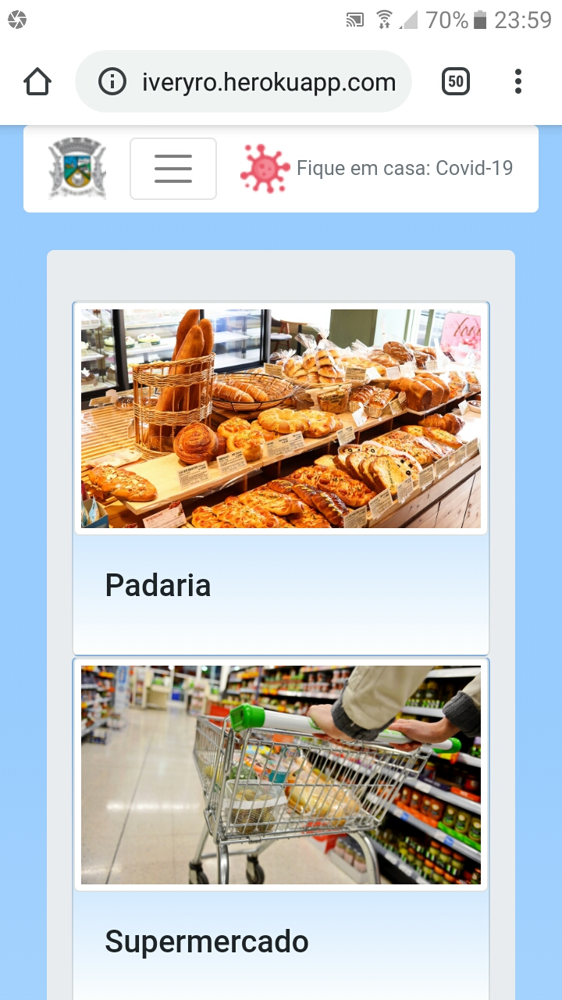
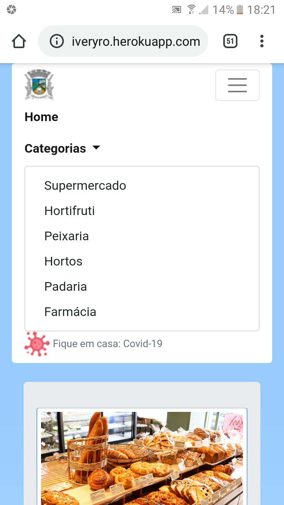
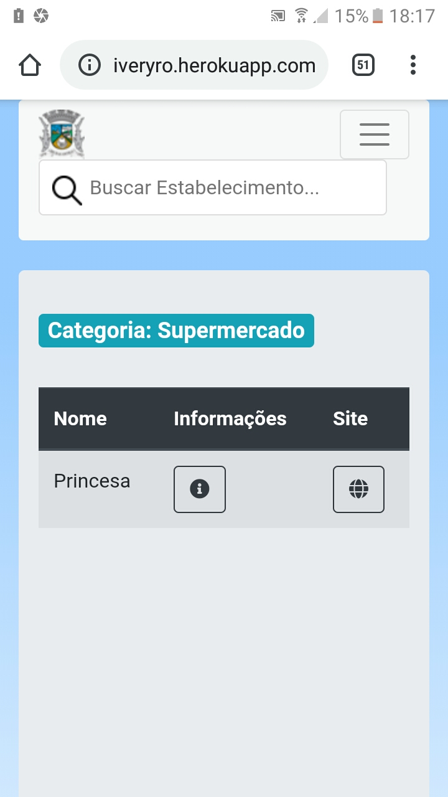
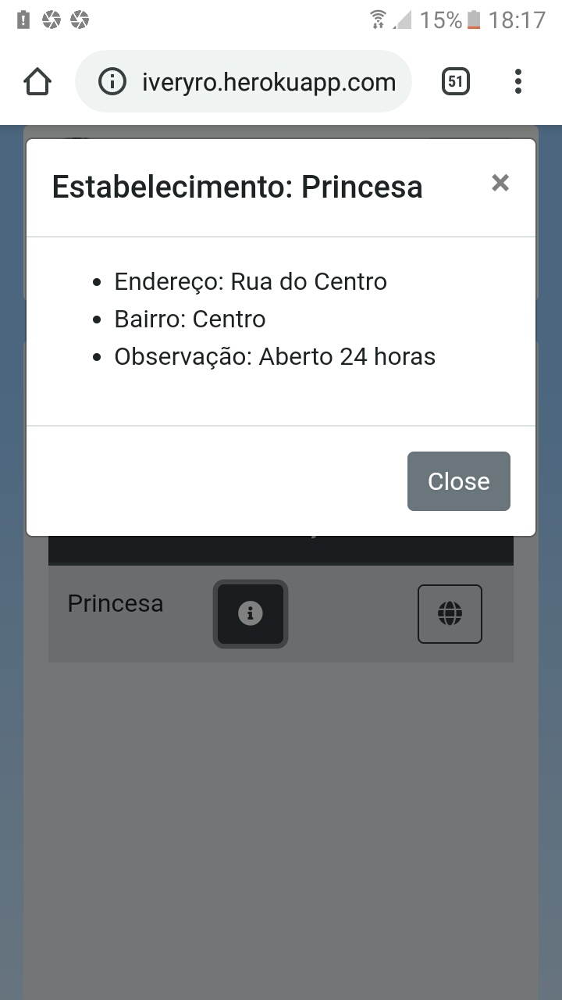

#Catalogo de Estabelecimentos Delivery
Plataforma web para cadastro de estabelecimentos deliveries em sua cidade.

</img>
</img>

</img>
</img>

Versão do Projeto 1.0

Sobre esta versão

Principais ferramentas: 

- Python 3.6
- Postgres
- Django 2.2

Instalação:

- pip install -r requirements.txt
- python manage.py makemigrations
- python manage.py migrate
- python manage.py runserver

- Acessar o serviço local na porta 8000 : 127.0.0.1:8000

